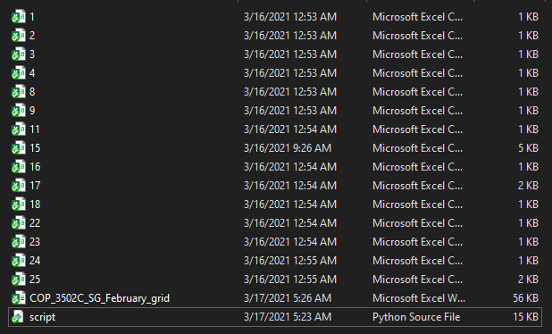
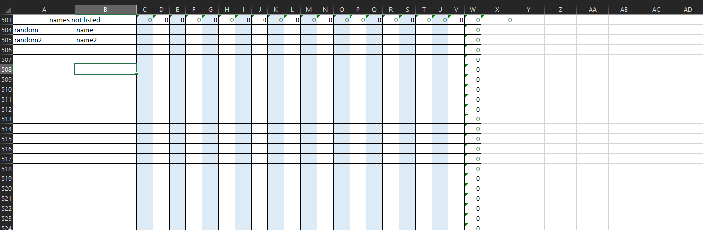
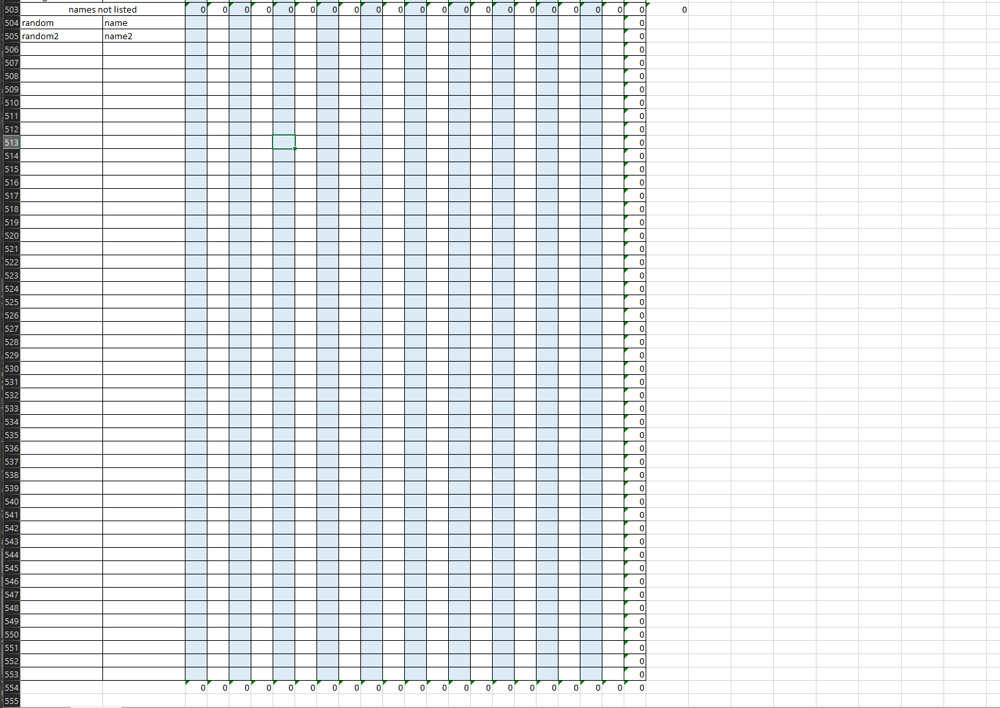

# How to use the script video instructions: [Video Link](https://youtu.be/4beUfSjgPsk)

# Step 0. MAKE A COPY OF YOUR GRID

- This is just in case something gets messed up for whatever reason.

# Step 1. Download the script from the link below:

- [Program Link](https://drive.google.com/file/d/1UXEVBG3RLQUZE7pIOD4LSwQfnvFy8E_w/view?usp=sharing "Program Link")

# Step 2. Download Zoom attendance reports

- Download all of the Zoom reports that you want to record in your grid.
- The reports can be reached by clicking Reports->Usage
- Make sure you check "Show unique users" before pressing export. This is important.
- Don't worry about your name showing up in the report, the script accounts for that.
- As you download each one, make sure that you are naming it after the day of the month that the meeting happened.
- For example, if you are downloading the attendance report for 2/18/21, name it 18
- Here is an image of what your folder should look like once you have downloaded several attendance reports:
  

# Step 3. Open the grid

- You will be asked a few questions about your grid since each grid has a different number of students.
- Make note of the number of the first blank row in your grid.
- Look at the image below as an example. The number of the first blank row is 506. If the 2 names were not there then it would be 504.
  
- The next row number to make a note of is the row where all of the attendance gets added up on. We would not want to overwrite that.
- In the image below, the row number we would want is 554. Make sure you don't get it confused with 503, which also has the sums of attendance.
  

# Step 4. Close the grid and all attendance reports

- If these are open when we run the script then it will not work.

# Step 5. Make sure that you have the following in the same folder:

- Grid
- script.exe
- All attendance reports

# Step 6. Run the script

- This is as easy as clicking on the 'script.exe' file in your folder.
- Answer each of the questions as mentioned above and in the video.
- At the end it will show you the list of names it couldn't put in the grid for whatever reason, so you can add them yourself.
- When you are done using the app, you can just type any letter and press enter to exit the script.
- Look at your grid and make sure there is no funny business going on before submitting it.
