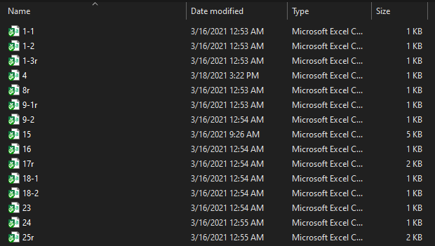

# How to use the script video instructions: [YouTube Link](https://youtu.be/ZyBdRUbwIjI)

# Step 0. MAKE A COPY OF YOUR GRID

- This is just in case something gets messed up for whatever reason.

# Step 1. Download the program from the link below:

- [Windows Program Link](https://drive.google.com/file/d/10aF93WIm0GppOFVVP8WDWILgIwMNaWaY/view?usp=sharing "Windows")
- [Ubuntu Program Link](https://drive.google.com/file/d/14bIVZYN4xORyQImkJ9SQQXz4rC18lkhW/view?usp=sharing "Ubuntu")
- [MacOS Program Link](https://drive.google.com/file/d/125wB-xjEZ7ZzZnDn_G2h4SrVCDBavt5r/view?usp=sharing "MacOS")

# Step 2. Download Zoom attendance reports

- Download all of the Zoom reports that you want to record in your grid.
- The reports can be reached by clicking Reports->Usage
- Make sure you check "Show unique users" before pressing export. This is important.
- Don't worry about your name showing up in the report, the program accounts for that.
- As you download each one, make sure that you are naming it using the following process:
  - write down the day of the month that the session occurred in. 
    - Ex: if the session is on 2/3/21, your title so far will be: 3
    - Ex: if the session is on 2/15/21, your title so far will be: 15
  - if it is one of multiple sessions in the same day, write a dash. 
    - Ex: if you have 2 or more sessions on 2/3/21, your title so far will be: 3-
    - Ex: if you have 2 or more sessions on 2/15/21, your title so far will be: 15-
  - if it is one of multiple sessions write if it is the 1st, 2nd, 3rd, etc session of that day. 
    - Ex: if you have 2 or more sessions on 2/3/21 and this is the first one, your title so far will be: 3-1
    - Ex: if you have 2 or more sessions on 2/15/21 and this is the second one, your title so far will be: 15-2
  - if it is a review session, write a lowercase r directly at the end
    - Ex: if you have 2 or more sessions on 2/3/21 and the first one is a review, your title so far will be: 3-1r
    - Ex: if you have 2 or more sessions on 2/3/21 and the third one is a review, your title so far will be: 3-3r
    - Ex: if you have 2 or more sessions on 2/15/21 and the second one is a review, your title so far will be: 15-2r
  - Naming the attendance reports correctly will be crucial for the program to run properly.
- Here is an image of what your folder might look like once you have downloaded several complicated attendance reports:
  
- Here is an image of what it might look like if you don't have any reviews and all of your sessions are on different days. It looks much nicer:
  

# Step 3. Open the grid

- You will be asked a few questions about your grid since each grid has a different number of students. 
- Make note of the number of the first blank row in your grid.
- Look at the image below as an example. The number of the first blank row is 506. If the 2 names were not there then it would be 504.
  
- The next row number to make a note of is the row where all of the attendance gets added up on. We would not want to overwrite that.
- In the image below, the row number we would want is 554. Make sure you don't get it confused with 503, which also has the sums of attendance.
  
- The next row number to make note of is the row that has the text 'names not listed'

# Step 4. Close the grid and all attendance reports

- These need to be closed for the program to work, otherwise it may just crash and you will have to restart.

# Step 5. Make sure that you have the following in the same folder:

- Grid
- autoGRID.exe (make sure you have the one for your operating system)
- All attendance reports

# Step 6. Run the program

- This is as easy as clicking on the autoGRID.exe file in your folder.
- Answer each of the questions as mentioned above and in the video.
- At the end it will show you the list of names it couldn't put in the grid for whatever reason, so you can add them yourself.
- When you are done using the app, you can just type any letter and press enter to exit the script.
- Look at your grid and make sure there is no funny business going on before submitting it.
